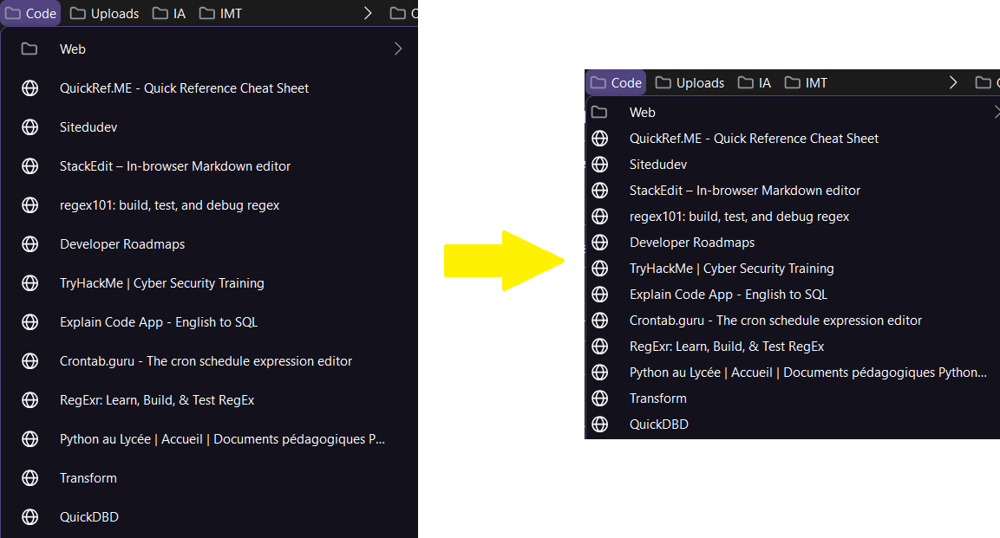

# Compact Bookmarks
Reduces padding and margins in bookmarks folders.

## Installation
1. Open about:support
2. Click on "Open Directory" next to "Profile Directory"
3. Create a folder named `chrome` if it doesn't exist
4. Place [userChrome.css](userChrome.css) in the `chrome` folder
5. Restart Firefox